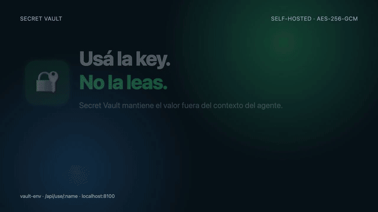

# Secret Vault

Secret Vault es una consola central para guardar una vez las credenciales que usan tus proyectos y agentes. Después, `vault-env` las entrega directamente al `.env` o al proceso que las necesita, sin que tengas que volver a copiarlas en cada conversación. Para llamadas opacas, el servidor también puede usar una credencial sin entregarle el valor al agente.

El servidor escucha por defecto en la LAN o tailnet, en el puerto `8100`. Es una herramienta self-hosted con el host como frontera de confianza, no un gestor de secretos público.

## Demo

<video controls muted playsinline width="100%" src="https://github.com/ram4-dev/secret-vault/raw/refs/heads/main/demo/outputs/secret-vault-demo.mp4">
  Tu visor no puede reproducir el video inline. [Abrir el MP4 directamente](demo/outputs/secret-vault-demo.mp4).
</video>

<a href="demo/outputs/secret-vault-demo.mp4"></a>

[Abrir el MP4 directamente](demo/outputs/secret-vault-demo.mp4) · [Código del video](demo/README.md)

El recorrido muestra el caso principal: guardar `GITHUB_TOKEN`, descubrir solo su nombre, llamar a `/api/use/GITHUB_TOKEN` y recibir una respuesta sin el valor plano.

## Camino rápido

1. Define una master key fuera del repositorio.
2. Inicia el servidor una vez, en tu máquina o en un host de tu tailnet.
3. Guarda cada secreto desde la consola web.
4. Desde cualquier proyecto, usa `vault-env` para seleccionar las claves que necesita.

```bash
export SECRET_VAULT_MASTER='cargada-por-tu-runtime'
npm start
open http://localhost:8100
```

La UI permite revelar valores solo con la master key. Esa vista es para el dueño de la consola y no forma parte del flujo del agente.

## Una consola para todos tus proyectos

El vault evita que cada proyecto tenga su propia copia manual de las credenciales. Guardás `GITHUB_TOKEN`, `OPENAI_API_KEY` o `COMPASS_API_KEY` una vez en la consola central, y después cada proyecto pide solo las claves que necesita.

```text
                 una sola vez                  en cada proyecto
              ┌─────────────────┐            ┌──────────────────────┐
              │ Secret Vault     │            │ proyecto-a           │
              │ consola central  │ ─────────▶ │ .env / proceso       │
              │ secretos cifrados│            └──────────────────────┘
              └─────────────────┘            ┌──────────────────────┐
                                             │ proyecto-b           │
                                             │ .env / proceso       │
                                             └──────────────────────┘
```

El agente arma el comando, pero no necesita conocer ni volver a recibir los valores. La salida de `vault-env` muestra solo las claves y los conteos.

## Por qué existe

Un agente puede necesitar autenticarse contra una API, pero leer una variable de entorno pone el valor dentro del contexto y de los logs de la conversación. Secret Vault separa descubrimiento, uso y lectura:

- `GET /api/secrets` devuelve nombres y metadatos, nunca `value`.
- `POST /api/use/:name` resuelve el secreto en el servidor y devuelve el resultado de la acción con redacción.
- `vault-env` escribe un `.env` o ejecuta un proceso directamente; su stdout muestra nombres y conteos, no valores.

## API recomendada

| Endpoint | Uso | ¿Devuelve el valor? |
|---|---|---:|
| `POST /api/secrets` `{name, value, description?}` | Crear o actualizar (upsert) | No |
| `GET /api/secrets` | Descubrir nombres | No |
| `POST /api/use/:name` `{action, params}` | Ejecutar `echo`, `http` o `exec` | No |
| `DELETE /api/secrets/:name` | Eliminar | No |

Ejemplo de uso opaco:

```bash
curl -s http://localhost:8100/api/use/GITHUB_TOKEN \
  -H 'Content-Type: application/json' \
  -d '{"action":"http","params":{"url":"https://api.github.com/user","headers":{"Accept":"application/vnd.github+json"},"inject":[{"header":"Authorization","secret":"GITHUB_TOKEN"}]}}'
```

El servidor agrega el header, hace la petición y redacta el secreto si la respuesta externa lo refleja. Para `exec`, el secreto se inyecta como variable de entorno del proceso hijo y también se redactan `stdout` y `stderr`.

## `vault-env`: llevar secretos a un proyecto sin copiarlos

```bash
vault-env to /path/project/.env --names GH_TOKEN,NAN_API_KEY
# ✓ 2 secretos → /path/project/.env (2 claves totales, permisos 600)

vault-env to .env --append --prefix COMPASS_    # agrega las claves COMPASS_ sin reemplazar las demás
vault-env run --names GH_TOKEN -- git push ...  # inyecta solo durante este proceso
vault-env list                                  # nombres disponibles, sin valores
```

El flujo habitual para un proyecto nuevo es:

```bash
cd /path/project
vault-env to .env --names OPENAI_API_KEY,GITHUB_TOKEN
chmod 600 .env
```

Para no crear un archivo local, ejecuta el comando con las variables inyectadas solo durante su vida:

```bash
vault-env run --names OPENAI_API_KEY -- npm run dev
```

- Los valores no aparecen en stdout: el CLI imprime nombres y conteos.
- La escritura es atómica (`tmp` + `rename`) y el archivo queda con permisos `600`.
- Hay que elegir explícitamente `--names`, `--prefix` o `--all`.
- `VAULT_URL` reemplaza el endpoint por defecto `http://127.0.0.1:8100`.
- `vault-env run` no redirige ni redacta el output del proceso hijo: la aplicación ejecutada no debe imprimir sus variables de entorno.

## Qué recibe un agente y qué recibe un proyecto

| Consumidor | Puede descubrir nombres | Puede usar el secreto | Recibe el valor plano |
|---|---:|---:|---:|
| Agente vía `GET /api/secrets` | Sí | Sí, vía `/api/use` | No |
| Proyecto vía `vault-env to` | Sí | Sí, desde su `.env` | El proceso destino sí |
| Proyecto vía `vault-env run` | Sí | Sí, durante el proceso | El proceso destino sí |
| Dueño en la consola web | Sí | Sí | Sí, con master key |

La separación es intencional: el proyecto necesita la credencial para funcionar; el agente solo necesita poder pedir que se use o preparar el entorno sin que el valor vuelva al chat.

## Excepción: inyección directa

Los endpoints `/api/env.py`, `/api/env.sh` y `/api/env.json` sí contienen valores. Úsalos solo para inyectar directamente en un runtime confiable, nunca para copiar el resultado al chat ni para entregárselo al modelo.

```python
exec(__import__('urllib.request', fromlist=['x']).urlopen("http://<vault-host>:8100/api/env.py").read())
# now os.environ has every secret
```

## Modelo de seguridad y límites

- Valores cifrados en reposo con AES-256-GCM y una master key (`SECRET_VAULT_MASTER`).
- La master key no sale de la consola del dueño.
- `/api/env.*` y la superficie LAN no tienen autenticación propia: el host es la frontera de confianza. Mantén el servicio en LAN/tailnet y no lo publiques.
- La master key no debe entrar al repositorio ni al contexto del agente.
- Prefiere `vault-env` y `/api/use` para agentes. `/api/env.*` es una excepción deliberada porque entrega valores al proceso destino.
- No hay multiusuario, roles ni auditoría avanzada en este MVP.

## Layout

```
server.js          HTTP server + routes
lib/store.js       encrypted store (load/save/upsert/delete)
lib/use.js         opaque actions (echo/http/exec) + redaction
bin/vault-env      CLI: vault → .env / process env
public/            web UI
tests/run.js       test runner
```

## Verificación

```bash
npm test
```

La suite comprueba almacenamiento cifrado, listado sin valores, `echo`, inyección en `exec`, redacción de salida y redacción de una respuesta HTTP que refleja el header.

## Varias máquinas

`vault-env` busca la URL en este orden: variable `VAULT_URL` → `~/.config/vault-env/url` (una línea) → `http://127.0.0.1:8100`.

En una máquina remota (por ejemplo, la MacBook):

```bash
scp bin/vault-env mac:/tmp/ && ssh mac 'mkdir -p ~/.local/bin ~/.config/vault-env   && mv /tmp/vault-env ~/.local/bin/vault-env && chmod +x ~/.local/bin/vault-env   && echo "http://100.94.34.87:8100" > ~/.config/vault-env/url'
```
